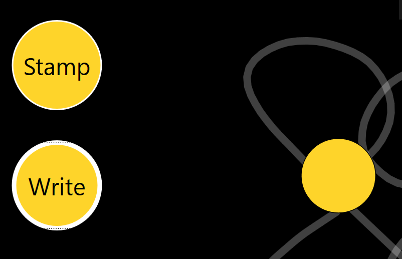
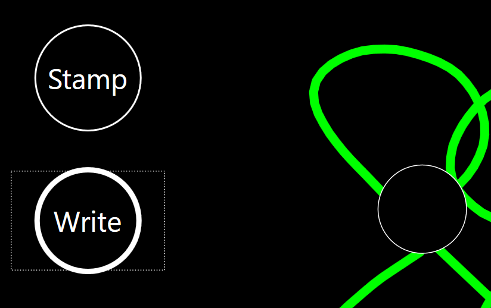
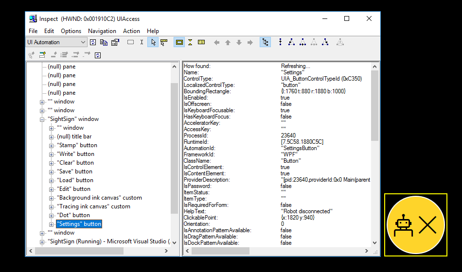

# The Accessibility of the SightSign app

The following technical details relate to the accessibility of the SightSign app.

# Input methods

The round buttons on the main page of the app are styled XAML Button controls. As such, they can be invoked through any input method that can invoke standard XAML buttons. These input methods include:

- Eyegaze
- Touch
- Mouse
- Keyboard
- Windows Speech Recognition, (WSR). Using WSR, the round buttons can be clicked with voice commands such as “Click stamp” and “Click dot”.
- Other input mechanisms that simulate mouse or keyboard input. For example, a switch device.

# Windows Magnifier

When Windows Magnifier is running in Fullscreen mode and is tracking keyboard focus, the magnified view will change to bring the button with keyboard focus into view. This is the default behavior for XAML Button controls, and so no specific work in the app was required in order to enable that view change. 

# Default accessibility of the app

This section describes some accessibility-related aspects of the app where no work in the app itself was required. 

An important note here is that by using styled standard controls, it is often less work, (sometimes considerably less work,) to build accessible features relative to the work involved when using custom controls.

The app consists of the following UI areas:

- The app window chrome and background.
- The Settings window.
- The round buttons, including those showing text strings and those that don’t.
- The ink-related area.

# Keyboard accessibility

The Settings window and app window chrome are fully keyboard accessible.

All round buttons, (including the Dot button,) are in the tab order and can be invoked through the keyboard. This is the default behavior for XAML Button controls.

# High Contrast

The Settings window and app window chrome respect the active high contrast theme.

When a high contrast theme is active, ink is automatically shown using the system window text color from that theme, and becomes 100% opaque. 

# Programmatic accessibility

The Settings window and app window chrome are programmatically accessible.

The round buttons which display text strings are fully programmatically accessible. The round buttons which do not display text strings are programmatically accessible, except for not having accessible names.

# Accessibility adjustments

Due to the specific requirements of the app, (particularly around its use of custom colors,) some action is required to enhance its default accessibility. 

# Keyboard accessibility

By default, the keyboard focus feedback on the round buttons is a black dashed line. This feedback is invisible on the black app background. In order to account for this, custom keyboard focus feedback has been added for all these buttons. 

Figure 1: The border of the Write button becomes thicker when it has keyboard focus.

Note that while it is necessary to generate custom feedback in the case of this WPF app, other UI frameworks might show another form of feedback. For example, a black and white dashed line. In those cases, no work would be required to account for the window background being black.

# High Contrast

Use of hard-coded colors for the app background, and for various elements of the round buttons must be replaced with system colors when a high contrast theme is active. All the related UI uses colors that are bound to properties in the app’s Settings class. The “get” for these properties check SystemParameters.HighContrast, and return system colors for Window, Control and ControlText when a high contrast theme is active.

When the animation of the dot begins in the app, a check is made for a high contrast theme being active, and the opacity of the dot is only set to 0.5 when a high contrast theme is not active.

Figure 2: The round buttons and ink respect system colors from the active high contrast theme, and all opacity is 100%.

# Programmatic accessibility

Accessible names were added for the two InkCanvas controls used by the app. 

Accessible names were added to the two round buttons which do not display text strings; these being the Dot button and the Settings button.

Note that the Settings button also visually conveys app state information, and as such, this information must also be programmatically accessible. That information is conveyed through the Button’s UI Automation HelpText property. 

Figure 3: The Inspect SDK tool reporting the UIA tree for the app.

While all the round buttons are being exposed through the Control view of the UIA tree, the buttons which are not currently visible have an IsOffscreen property of True.
